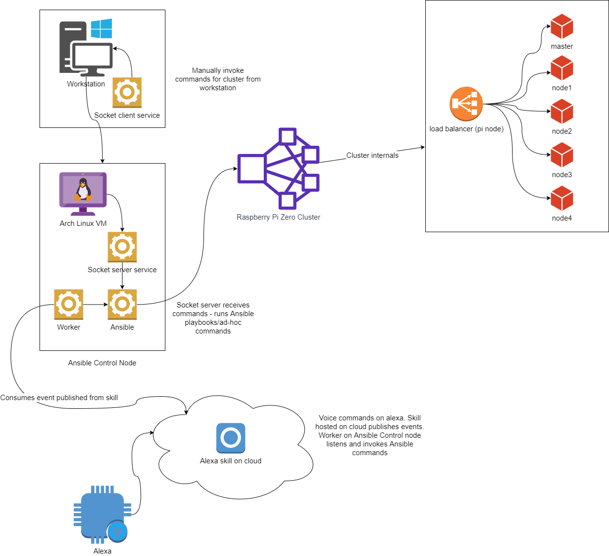

# pi-cluster-infrastructure
Raspberry Pi Zero cluster infrastructure

This repository contains all infrastructure code that automates cluster management and maintenance.
Cluster is managed by Ansible which provides a certain level of automation on common infrastructure tasks run agains cluster nodes.

# Setup
The Ansible control node runs on a Hyper-V VM which itself runs on Arch Linux. The control node automates work like, reboot, shutdown, plugin install, system configuration and many other actions on a 6 node cluster.

This repo contains Powershell scripts to create the VM from scratch. Information on how to install Arch Linux can be found [here](https://wiki.archlinux.org/index.php/installation_guide).

## Ansible
Control node has information for its hosts on /etc/ansible/hosts file, which is included in the repository (no information on IP/username/password included though).
### Playbooks
All playbooks are listed under the /ansible/playbooks directory in this repository. I've installed all playbooks at /home/playbooks directory and scripts at /home/scripts directory respectively. The scripts directory contains shell scripts which make it easier to execute the ansible commands.

#### Shutdown
The shutdown.yml playbook commands all pi zero nodes to shutdown. It executes the shutdown command and immediatelly waits for the nodes to stop in order to mark the playbook successful. Use the `shutdown_pizerocluster.sh` to invoke this playbook.

## Socket server application
This is a C socket server. It receives commands from client application and executes the appropriate playbook/ad-hoc command on Ansible Control Node.

## Socket client application
This is a Java socket client, which sends commands to server application to execute certain playbooks/ad-hoc commands on the Ansible Control Node.

## Alexa app
Alexa application which receives voice input, which translates to application-level commands for Ansible Control Node to execute. The commands are send to socket server to decide what to do next.